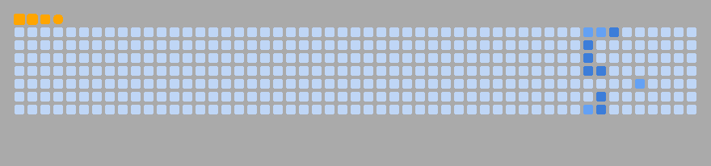

### Hi there 👋

<table align="center">
    <tr>
        <td align="center">
          <picture>
            
          </picture>
        </td>
        <td align="center">
          <picture>
            
          </picture>
        </td>
    </tr>
</table>

### Trophy 🏆

  

### contributions

<picture>
<!-- 根据主题颜色来决定用亮的还是黑的 -->
  <source media="(prefers-color-scheme: dark)" srcs="./dist/github-snack-dark.svg" />
  <source media="(prefers-color-scheme: light)" src="./dist/github-snack.svg" />
  
</picture>
